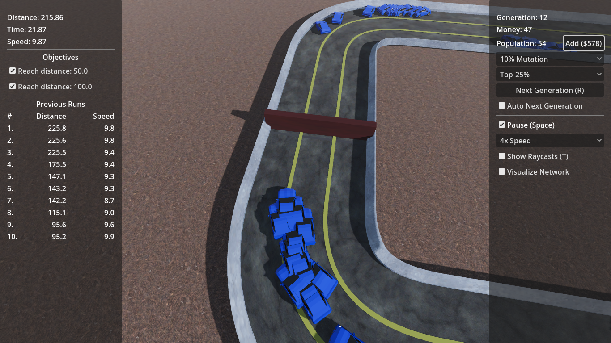
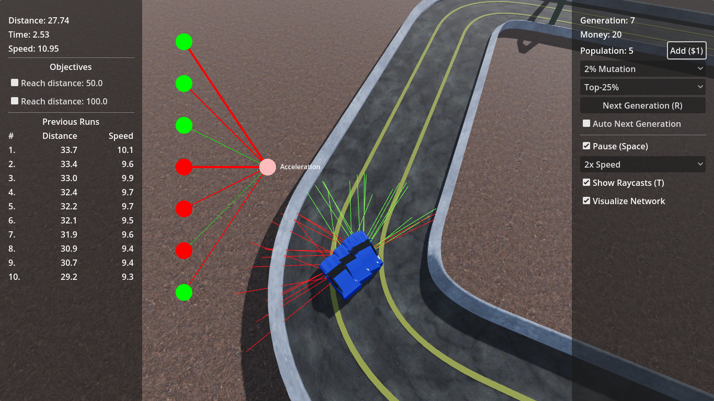
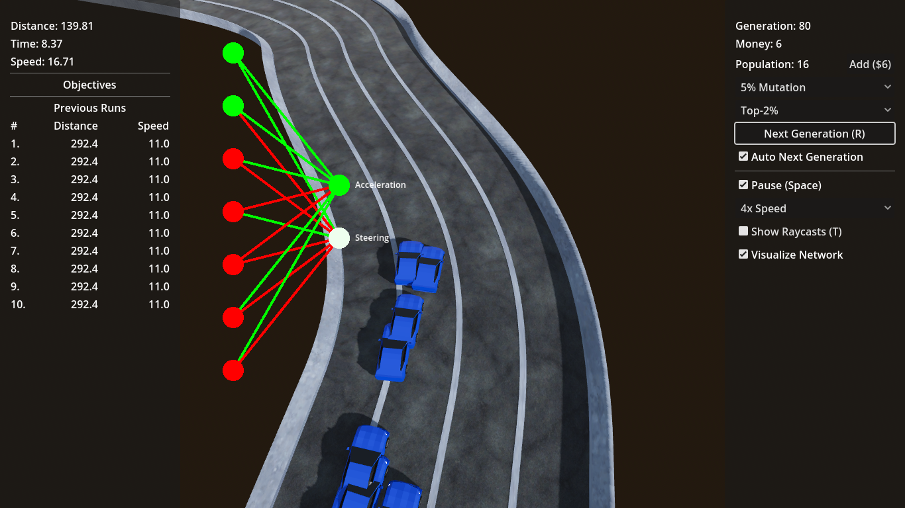

# Driven to Evolve

Failure is not the end; it’s how you learn to drive. In Driven to Evolve, your crashes fuel your progress. Harness the power of evolution to train a neural network of AI drivers, using a genetic algorithm to improve with every generation.

- This game is a [Mini Jam 186 entry](https://itch.io/jam/mini-jam-186-evolution).
- [itch.io link](https://necrashter.itch.io/driven-to-evolve)

## Screenshots

## Get Started

1. Clone the repository.
2. Install NumDot 0.8 in ./numdot folder.
3. Edit using Godot 4.4.1.
